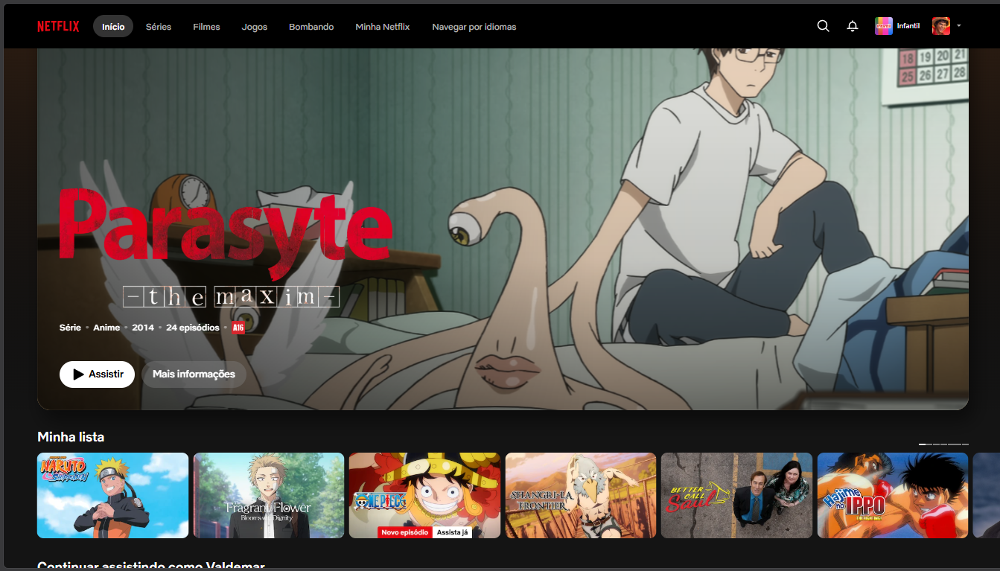
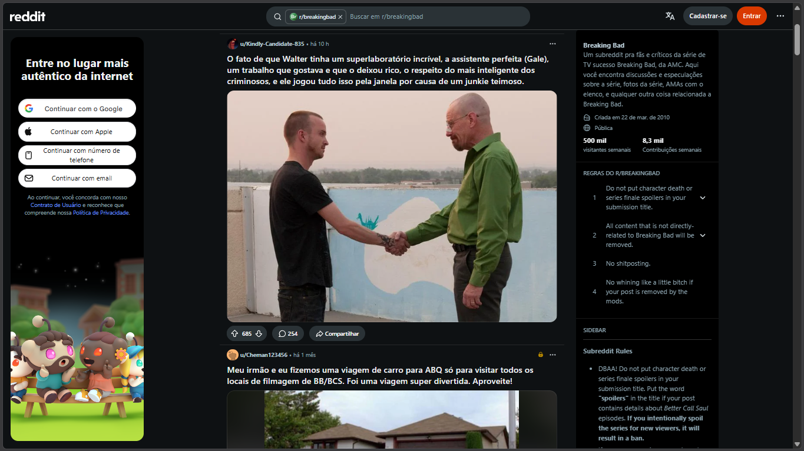
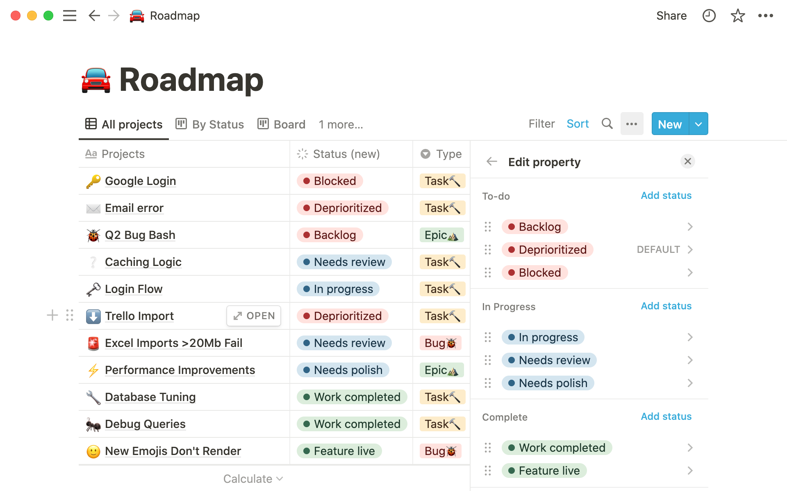

# References — Próximo TV Time

## 1. Objetivo

As referências abaixo orientam as decisões de experiência e interface. Foram escolhidos três produtos conhecidos, e cada um inspira uma parte do Próximo TV Time: a Netflix, para descobrir o que assistir; o Reddit, para o fórum de discussões; e o Notion, para organizar séries por status. As imagens servem apenas como estudo de interface, e os direitos pertencem aos respectivos donos.

## 2. Referência 01 — Netflix

### Fonte
https://www.netflix.com/br/ — captura da tela inicial, em setembro de 2026.

### Imagem

### O que observamos?
- Um banner grande no topo destaca um título, com imagem de fundo, descrição curta e botões de ação.
- Abaixo dele, os títulos aparecem em fileiras horizontais por categoria.
- Cada título é um pôster; ao passar o mouse, ele se destaca.
- O tema é escuro, o que coloca os pôsteres em evidência.

### O que vamos aproveitar?
O banner de destaque no topo, as fileiras horizontais de pôsteres e o tema escuro.

### Onde será usado?
Na página Início (`/`), com os componentes `Hero` e `Carousel`, que usam cards `SerieCard`. O tema escuro vale para o site inteiro, e o efeito ao passar o mouse fica no `SerieCard`.

### Como será adaptado?
Em vez de um catálogo de streaming, as fileiras trazem recomendações do TMDB: "Em alta esta semana" e "Mais bem avaliadas". Não há player de vídeo; o botão do destaque leva à página da série. No celular, a fileira rola com o dedo.

### Por que é adequado?
Quem abre o site geralmente ainda não sabe o que quer ver. Enxergar vários pôsteres de uma vez, agrupados por categoria, permite escolher sem digitar nada. É um padrão que o público já conhece, então não precisa de explicação.

## 3. Referência 02 — Reddit

### Fonte
https://www.reddit.com/ — captura de uma comunidade sobre séries (por exemplo, r/television), em setembro de 2026.

### Imagem

### O que observamos?
- Cada post é um cartão com título, comunidade, número de comentários e um contador de votos com setas.
- Todos os posts seguem a mesma estrutura, então a lista é fácil de percorrer.
- O Reddit permite marcar posts e trechos como spoiler: o conteúdo fica escondido, com um aviso, até o usuário clicar para ver.

### O que vamos aproveitar?
O cartão de tópico com a coluna de votos e a contagem de comentários, e o aviso de spoiler que esconde o conteúdo até o clique.

### Onde será usado?
Na página Fórum (`/forum`), com o `TopicoCard` (votos, título, série e comentários) e o `SpoilerText` (conteúdo borrado).

### Como será adaptado?
De forma simplificada: só há voto positivo, não há comunidades separadas (o tópico apenas indica a série) e não há contas de usuário; os dados ficam no navegador. O aviso de spoiler vale para mensagens de tópicos e para comentários.

### Por que é adequado?
Conversar sobre episódios é uma das razões de uso do TV Time, e o maior risco dessa conversa é levar spoilers. Esconder o conteúdo até o clique protege quem ainda não assistiu e mantém a discussão aberta para quem já viu.

## 4. Referência 03 — Notion

### Fonte
https://www.notion.com/ — captura de um banco de dados (tabela ou quadro) com coluna de status, em setembro de 2026.

### Imagem

### O que observamos?
- Os itens são organizados por uma propriedade de status, mostrada como uma etiqueta colorida.
- A visualização em quadro separa os itens em colunas por status, e a tabela mostra a mesma informação em linhas.
- O visual é limpo, com bastante espaço em branco e poucos elementos por vez.

### O que vamos aproveitar?
A organização por status com etiquetas coloridas e o visual limpo, com bom espaçamento.

### Onde será usado?
Em Minha lista (`/minha-lista`), nas abas por status (componente `Tabs`), e na página da série (`/serie/:id`), nos botões de status "Quero ver", "Assistindo" e "Assistido".

### Como será adaptado?
Os status do Notion viram os três status de série, cada um com uma cor própria, repetida nas abas e nos botões. Em vez de colunas de quadro, usamos abas com contador, que funcionam melhor em telas pequenas. O site mantém o tema escuro; do Notion levamos a organização e o espaçamento, não as cores de fundo.

### Por que é adequado?
Quem acompanha séries precisa separar o que quer ver, o que está vendo e o que já viu. Um status simples e colorido resolve isso sem exigir que o usuário monte pastas ou listas por conta própria.

## 5. Resumo

| Referência | Elemento aproveitado | Onde foi usado | Por que é adequado |
|---|---|---|---|
| Netflix | Destaque no topo, fileiras de pôsteres e tema escuro | Início (`Hero`, `Carousel`, `SerieCard`) | Ajuda quem não sabe o que assistir a escolher sem digitar |
| Reddit | Cartão de tópico com votos e aviso de spoiler | Fórum (`TopicoCard`, `SpoilerText`) | Permite conversar sobre séries sem estragar a surpresa de ninguém |
| Notion | Status com etiquetas coloridas e visual limpo | Minha lista e página da série (`Tabs`, botões de status) | Organiza o que se quer ver, o que se está vendo e o que já foi visto |
